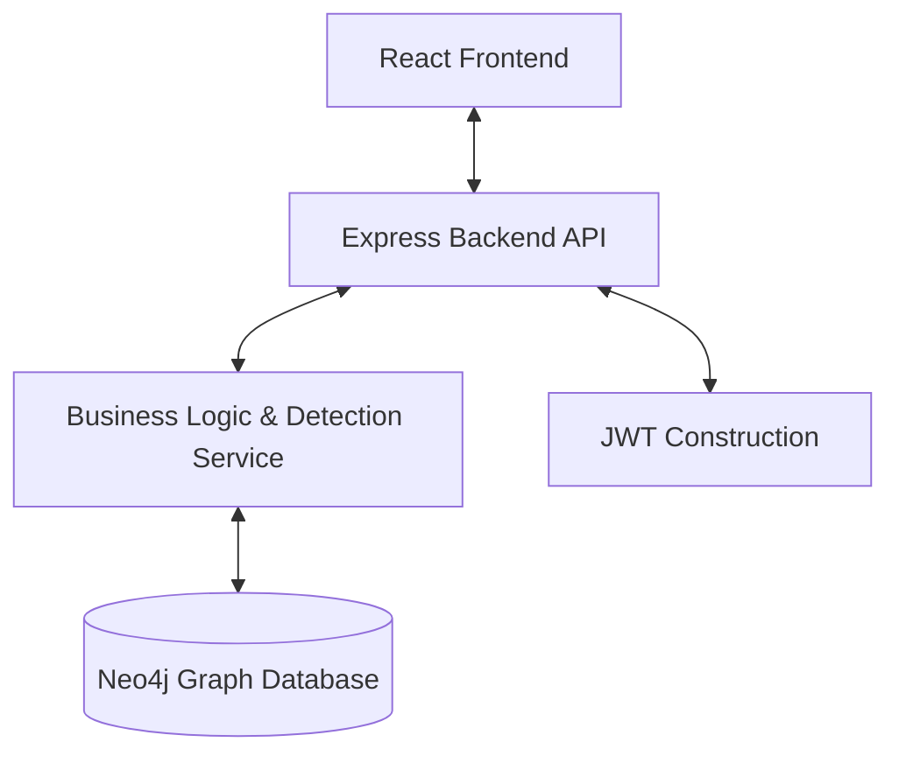

# NeoFraud Sentinel 🛡️

> **Système de Détection de Fraude Bancaire Avancé par Analyse de Graphes**

[](https://opensource.org/licenses/MIT)
[](https://neo4j.com/)
[](https://nodejs.org/)
[](https://reactjs.org/)

**NeoFraud Sentinel** est une plateforme d'entreprise conçue pour identifier, visualiser et prévenir la fraude financière complexe. Contrairement aux systèmes traditionnels basés sur des règles linéaires, notre solution exploite la puissance des **bases de données orientées graphes (Neo4j)** pour détecter les connexions cachées et les réseaux criminels organisés.

---

## 🚀 Fonctionnalités Clés

### 🧠 Moteur de Détection Intelligent
Utilisation de requêtes Cypher optimisées pour identifier des patterns de fraude sophistiqués :
- **Velocity Check** (`TRANSACTIONS_RAPIDES`): Détection de rafales de transactions anormales (< 10 min).
- **Device & IP Sharing** (`IP_PARTAGEE`, `MULTI_COMPTES`): Identification des appareils ou IPs contrôlant de multiples comptes distincts.
- **High Value Anomalies** (`MONTANT_ELEVE`): Surveillance des flux financiers dépassant les seuils de risque.

### 📊 Tableau de Bord Analytique
- **Vues Globales** : Statistiques en temps réel sur les taux de fraude et la répartition des alertes.
- **Explorateur de Graphes** : Visualisation interactive des nœuds (Clients, Comptes, Transactions, IPs) pour les enquêteurs.

### 🛡️ Sécurité & Gestion
- **Ingestion Massive** : Pipeline de traitement CSV robuste pour l'importation de millions de transactions.
- **Workflow d'Investigation** : Gestion des états d'alerte (NOUVEAU, EN_COURS, RESOLU) par les analystes.
- **RBAC (Role-Based Access Control)** : Ségrégation stricte des droits (ADMIN, ANALYSTE, BANQUE).

---

## 🛠️ Stack Technique

- **Base de Données** : [Neo4j](https://neo4j.com/) (Graph Database) - *Le cœur du système de détection.*
- **Backend API** : Node.js & Express - *Architecture RESTful et Services.*
  - **Sécurité** : JWT, Bcrypt, Helmet.
  - **Validation** : Joi, Middleware de gestion d'erreurs.
- **Frontend** : React 18 & Vite - *Interface utilisateur haute performance.*
  - **Visualisation** : Recharts, Lucide Icons.
  - **Design** : Custom CSS moderne et réactif.

---

## 📦 Installation & Configuration

### Prérequis
- **Node.js** (v18 ou supérieur)
- **Neo4j Desktop** ou **Neo4j AuraDB** (Instance locale ou cloud)

### 1. Configuration de la Base de Données
1. Lancez votre instance Neo4j.
2. Créez un projet local.
3. URI par défaut : `bolt://localhost:7687`

### 2. Installation du Backend
```bash
cd backend
npm install

# Configuration des variables d'environnement
cp .env.example .env
# Ouvrez .env et configurez :
# NEO4J_URI=bolt://localhost:7687
# NEO4J_USER=neo4j
# NEO4J_PASSWORD=votre_mot_de_passe
# JWT_SECRET=votre_secret_securise

# Lancer en mode développement
npm run dev
```

### 3. Installation du Frontend
```bash
cd frontend
npm install

# Lancer le serveur de développement
npm run dev
```

---

## 🧪 Guide d'Utilisation Rapide

1. **Accès** : Ouvrez `http://localhost:5173` dans votre navigateur.
2. **Inscription Administrateur** : Créez un premier compte avec le rôle `ADMIN`.
3. **Import de Données** :
   - Naviguez vers l'onglet **Upload**.
   - Chargez le fichier de test inclus : `backend/sample_transactions.csv`.
4. **Lancement de l'Analyse** :
   - Allez dans la section **Alertes**.
   - Cliquez sur **"Lancer la Détection"**. Le moteur de règles analysera le graphe.
5. **Investigation** :
   - Cliquez sur une alerte pour voir les détails.
   - Utilisez le **Visualisateur de Graphe** pour explorer les liens suspects.

---

## 🏗️ Architecture du Projet

Le projet suit une architecture en couches (Layered Architecture) pour assurer maintenabilité et scalabilité.



## 📝 Licence
Ce projet est sous licence MIT.

---
*Développé avec ❤️ pour la sécurité financière.*
